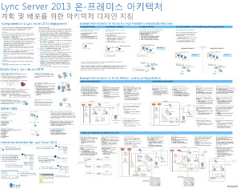
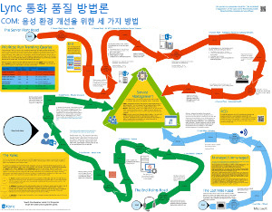
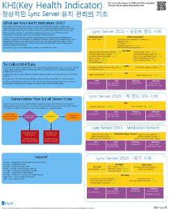
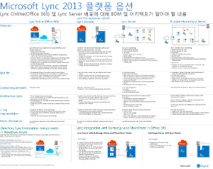
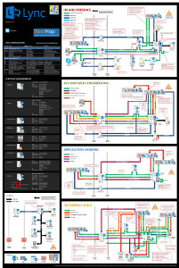

---
title: Lync Server 2013 기술 다이어그램
TOCTitle: 기술 다이어그램
ms:assetid: 7b6da49b-ac72-4ab0-8957-166e330b38fa
ms:mtpsurl: https://technet.microsoft.com/ko-kr/library/Dn594589(v=OCS.15)
ms:contentKeyID: 61170937
ms.date: 08/24/2015
mtps_version: v=OCS.15
ms.translationtype: HT
---

# Lync Server 2013의 기술 다이어그램

 

_**마지막으로 수정된 항목:** 2015-03-09_

**요약:** 다이어그램을 통해 Lync 2013에 대한 권장 솔루션을 시각적으로 제공합니다.

여기에 나와 있는 리소스는 Visio(.vsd) 형식(Visio 2010 또는 Visio 2013)과 PDF 형식으로 사용 가능합니다. 문서를 인쇄하는 방법에 대한 자세한 내용은 포스터 인쇄 팁을 참고하세요.

이러한 파일을 보려면 추가 소프트웨어가 필요할 수도 있습니다. 자세한 내용은 다음 표를 참고하세요.

<table>
<colgroup>
<col style="width: 50%" />
<col style="width: 50%" />
</colgroup>
<thead>
<tr class="header">
<th>파일 형식</th>
<th>소프트웨어</th>
</tr>
</thead>
<tbody>
<tr class="odd">
<td>
.vsd
</td>
<td>
Visio 2010, Visio 2013 또는 <a href="http://go.microsoft.com/fwlink/?linkid=393676">무료 Visio 뷰어</a>

Visio 뷰어를 사용하는 경우 VSD 링크를 마우스 오른쪽 단추로 클릭하고 <strong>다른 이름으로 대상 저장</strong>을 클릭한 다음 파일을 컴퓨터에 저장한 후 컴퓨터에서 해당 파일을 엽니다.
</td>
</tr>
<tr class="even">
<td>
.pdf
</td>
<td>
<a href="http://go.microsoft.com/fwlink/?linkid=393675">Adobe Reader</a>와 같은 PDF 뷰어
</td>
</tr>
<tr class="odd">
<td>
.zip
</td>
<td>
파일 압축 유틸리티. Windows 7 및 8에서는 이러한 파일이 기본적으로 열립니다.
</td>
</tr>
</tbody>
</table>

## 포스터

다음 포스터는 특정 기술 영역을 자세히 설명하며 TechNet의 해당 문서나 다운로드 센터의 해당 콘텐츠와 함께 사용할 수 있습니다.

<table>
<colgroup>
<col style="width: 50%" />
<col style="width: 50%" />
</colgroup>
<thead>
<tr class="header">
<th>제목</th>
<th>설명</th>
</tr>
</thead>
<tbody>
<tr class="odd">
<td>
<strong>Lync Server 2013 온-프레미스 아키텍처</strong>

<a href="http://go.microsoft.com/fwlink/?linkid=392974">Microsoft의 Zoom.it으로 포스터를 상세히 확대</a>(데스크톱 또는 노트북 컴퓨터에 가장 적합함)

<a href="http://go.microsoft.com/fwlink/?linkid=392578">PDF 버전</a>(모바일 장치나 태블릿 컴퓨터에 가장 적합함)

<a href="http://go.microsoft.com/fwlink/?linkid=392579">Visio 버전</a>(Visio 사용자에게 가장 적합함)
</td>
<td>
포스터에는 계획 및 배포를 위한 아키텍처 지침이 제공됩니다. 포스터에는 Lync Server의 일반적인 구성 요소, 배포를 계획할 때 사용되는 용어, 새 기능, 서버 역할, 설치 개요가 포함됩니다. 이 외에도 포스터에는 고가용성 증대 및 재해 복구에 대한 예제 아키텍처와 소/중/대형 샘플 토폴로지도 포함되어 있습니다.

크기: 34x44인치

이 포스터는 Visio 2013을 사용하여 만들어졌습니다. 특정 환경에 맞게 수정할 필요가 없습니다.
</td>
</tr>
<tr class="even">
<td>
<strong>Lync 통화 품질 방법론</strong>

<a href="http://go.microsoft.com/fwlink/?linkid=392972">Microsoft의 Zoom.it으로 포스터를 상세히 확대</a>(데스크톱 또는 노트북 컴퓨터에 가장 적합함)

<a href="http://go.microsoft.com/fwlink/?linkid=391841">.zip 파일에 Visio 및 PDF 버전 모두 포함</a>
</td>
<td>
특히 엔터프라이즈 음성 품질에 영향을 주는 문제에 대한 Lync 시스템 문제 해결을 설명하는 포스터입니다. 이 포스터는 다음과 함께 사용합니다.

<ul>
<li>
<a href="http://go.microsoft.com/fwlink/p/?linkid=390677">Lync Server 네트워킹 가이드</a>
</li>
<li>
<a href="lync-server-2013-poster-lync-call-quality-methodology.md">Lync Server 2013의 Lync 통화 품질 방법론</a>(접근성 문서)
</li>
<li>
<a href="lync-server-2013-poster-key-health-indicators.md">Lync Server 2013의 주요 상태 표시기</a>(접근성 문서)
</li>
</ul>

크기: 34x44인치

이 포스터는 Visio 2010을 사용하여 만들어졌습니다. 특정 환경에 맞게 수정할 필요가 없습니다.
</td>
</tr>
<tr class="odd">
<td>
<strong>주요 상태 표시기</strong>

<a href="http://go.microsoft.com/fwlink/?linkid=392971">Microsoft의 Zoom.it으로 포스터를 상세히 확대</a>(데스크톱 또는 노트북 컴퓨터에 가장 적합함)

<a href="http://go.microsoft.com/fwlink/?linkid=391838">.zip 파일에 Visio 및 PDF 버전 모두 포함</a>
</td>
<td>
기본 서버 상태 및 Lync 구현에서 특정 서버 역할에 대한 서버 문제 해결 메트릭을 설명하는 포스터입니다. 이 포스터는 다음과 함께 사용합니다.

<ul>
<li>
<a href="http://go.microsoft.com/fwlink/p/?linkid=390677">Lync Server 네트워킹 가이드</a>
</li>
<li>
<a href="lync-server-2013-poster-lync-call-quality-methodology.md">Lync Server 2013의 Lync 통화 품질 방법론</a>(접근성 문서)
</li>
<li>
<a href="lync-server-2013-poster-key-health-indicators.md">Lync Server 2013의 주요 상태 표시기</a>(접근성 문서)
</li>
</ul>

크기: 17x22인치

이 포스터는 Visio 2010을 사용하여 만들어졌습니다. 특정 환경에 맞게 수정할 필요가 없습니다.
</td>
</tr>
<tr class="even">
<td>
<strong>Lync 2013 플랫폼 옵션</strong>

<a href="http://go.microsoft.com/fwlink/p/?linkid=391840">Microsoft의 Zoom.it으로 포스터를 상세히 확대</a>

<a href="http://go.microsoft.com/fwlink/p/?linkid=391837">PDF 버전</a>(모바일 장치나 태블릿 컴퓨터에 가장 적합함)

<a href="http://go.microsoft.com/fwlink/p/?linkid=391839">Visio 버전</a>(Visio 사용자에게 가장 적합함)
</td>
<td>
이 포스터는 BDM 및 설계자가 사용할 수 있는 Lync 2013의 플랫폼 옵션에 대해 설명합니다. 고객은 Office 365용 Lync Online, 하이브리드 Lync, Lync Server 온-프레미스, 호스트된 Lync 중에서 선택할 수 있습니다. 이 포스터에는 각 아키텍처 옵션에 대한 세부 내용을 비롯하여 각각에 대한 가장 적절한 시나리오, 라이선스 요구 사항, IT 전문가의 책임이 포함되어 있습니다.

크기: 34x44인치

이 포스터는 Visio 2013을 사용하여 만들어졌습니다. 특정 환경에 맞게 수정할 필요가 없습니다.
</td>
</tr>
<tr class="odd">
<td>
<strong>Microsoft Lync Server 2013 프로토콜 작업</strong>

<a href="http://go.microsoft.com/fwlink/?linkid=392970">Microsoft의 Zoom.it으로 포스터를 상세히 확대</a>

<a href="http://go.microsoft.com/fwlink/?linkid=392512">PDF 버전</a>(모바일 장치나 태블릿 컴퓨터에 가장 적합함)

<a href="http://go.microsoft.com/fwlink/?linkid=392513">Visio 버전</a>(Visio 사용자에게 가장 적합함)
</td>
<td>
이 포스터를 다운로드하여 Lync 2013, Lync 전화, Lync Web App, Lync for Mac, Lync Mobile의 기능 및 요구 사항에 대해 알아보세요. Lync Server 작업이 조직 전체의 통신을 어떻게 원활하게 하는지 알아보세요.

크기: 24x36인치

이 포스터는 Visio 2013을 사용하여 만들어졌습니다. 특정 환경에 맞게 수정할 필요가 없습니다.
</td>
</tr>
</tbody>
</table>

## 포스터 인쇄 팁

플로터가 있으면 이러한 포스터를 전체 크기로 인쇄할 수 있습니다. 플로터가 없는 경우에는 다음 단계를 따라 작은 용지에 인쇄합니다.

**작은 용지에 포스터 인쇄**

1.  포스터를 Visio에서 엽니다.

2.  **파일** 메뉴에서 **페이지 설정**을 클릭합니다.

3.  **인쇄 설정** 탭의 **인쇄 용지** 섹션에서 인쇄하려는 용지의 크기를 선택합니다.

4.  **인쇄 설정** 탭의 **확대/축소 인쇄** 섹션에서 **자동 맞춤**을 클릭한 다음 **1 용지 너비 1 용지 높이**를 입력합니다.

5.  **페이지 크기** 탭에서 **드로잉 내용에 맞게 크기 조정**을 클릭한 다음 **확인**을 클릭합니다.

6.  **파일** 메뉴에서 **인쇄**를 클릭합니다.

